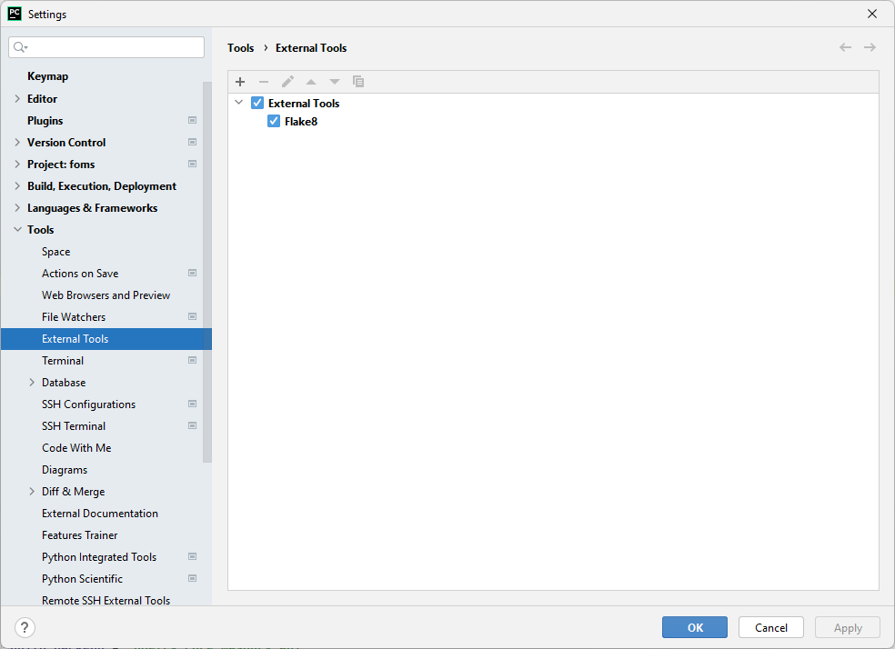
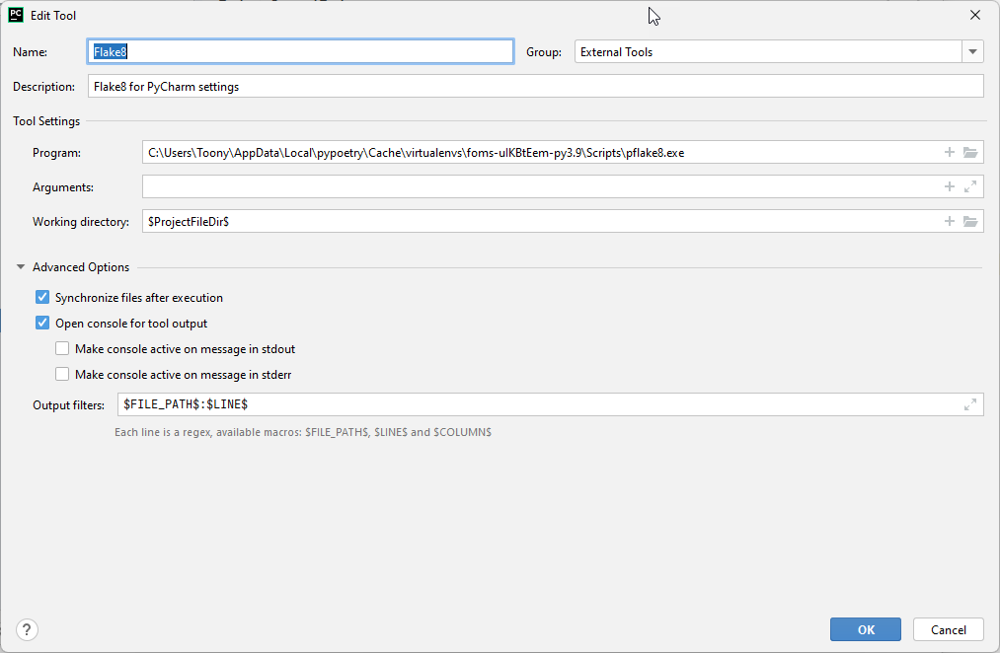
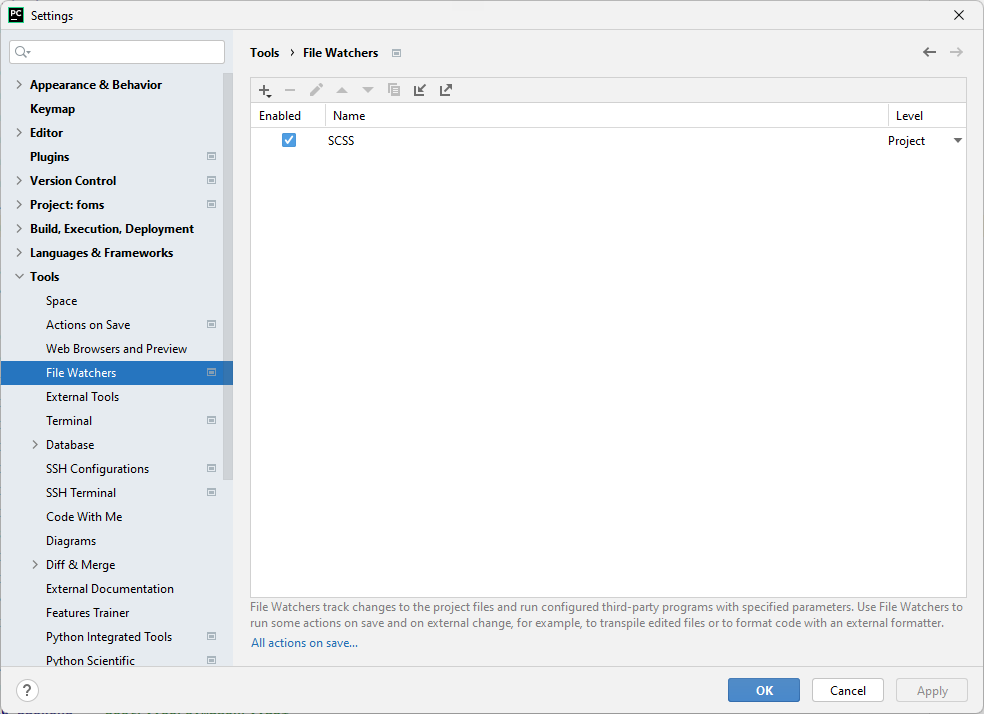
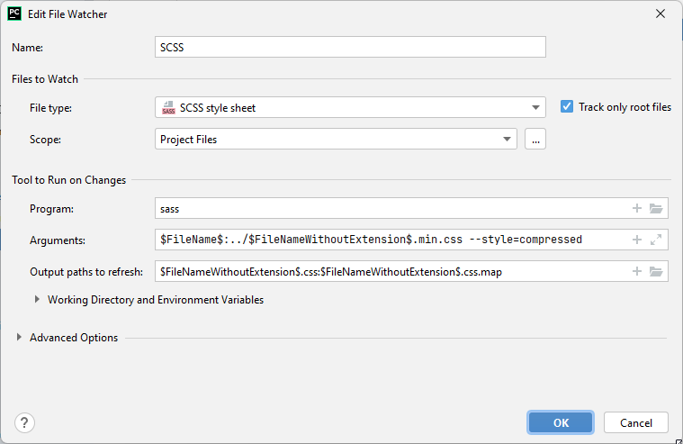

## Список мануалов для повседневных настроек PyCharm

### Flake8

#### Популярные библиотеки

* flake8
* flake8-annotations
* flake8-cognitive-complexity
* flake8-expression-complexity
* flake8-simplify
* flake8-import-order
* flake8-variables-names
* flake8-commas
* pep8-naming
* flake8-builtins
* flake8-bugbear
* pyproject-flake8

### SCSS

Для работы нужен nodejs установить следующей командой

`npm install -g sass`

